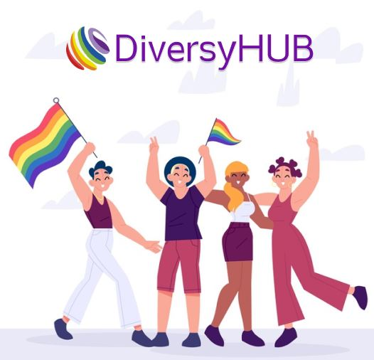

<h1 align="center">
  

DiversyHUB - Diversidade dentro do mercado de trabalho

</h1>

# # {reprograma} Projeto Final | DiversyHUB - API :rainbow:
Projeto de conclusão do bootcamp de desenvolvimento Back-end da [{reprograma}](https://reprograma.com.br/) em parceria com o [projeto MINAs do Porto Digital](https://www.portodigital.org/capital-humano/iniciativas-para-a-diversidade/mulheres-em-inovacao-negocios-e-artes-minas)

## Objetivo

Essa é uma *API* com banco de dados de mulheres transexuais e travestis que estão desempregades, possibilitando que essas pessoas se cadastrem para ficarem visíveis aos empregadores e, do outro lado, permitirá que o recrutador busque candidates adequadades ao perfil esperado para as vagas ofertadas em suas empresas.

#### Requisitos obrigatórios:

### Requisitos desejáveis:

### Ferramentas utilizadas

### Instalação

### Endpoints